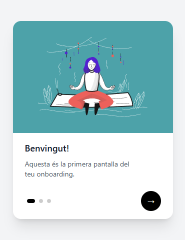
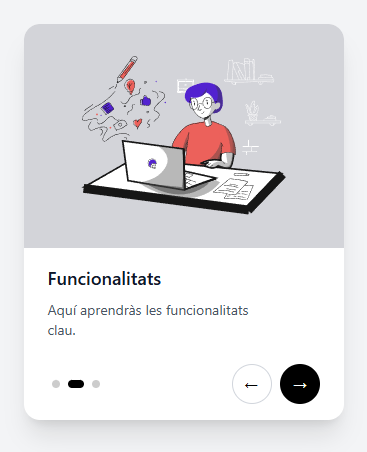
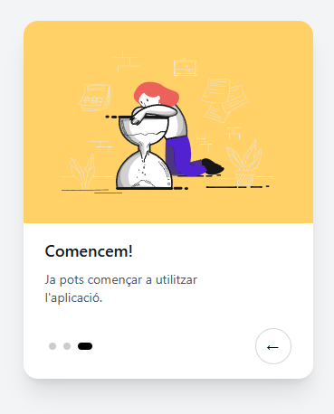

# 🧘‍♂️ Onboarding Tutorial App

This project is a responsive onboarding tutorial built with **React**, **Vite**, **TypeScript**, and **Tailwind CSS**. It walks users through a series of informative steps using animated cards and a custom step indicator.

## 🛠 Tech Stack

- ⚛️ [React](https://reactjs.org/)
- ⚡ [Vite](https://vitejs.dev/)
- 💨 [Tailwind CSS](https://tailwindcss.com/)
- 🔠 TypeScript
- 🎞️ [Framer Motion](https://www.framer.com/motion/) – for smooth animations

---

## 📦 Getting Started

### 1. Clone the repository

```bash
git clone https://github.com/your-username/your-repo-name.git
cd your-repo-name
```

### 2. Install dependencies

```bash
npm install
```

### 3. Run the development server

```bash
npm run dev
```

## 📁 Project Structure

```bash
src/
├── assets/           # SVG illustrations
├── components/
│   ├── Card.tsx      # Main card component
│   └── Indicator.tsx # Custom step indicator
├── App.tsx           # App logic and step management
├── main.tsx          # Entry point
└── index.css 
```

## 📸 Screenshots





## ✅ Features

- Animated card transitions
- Responsive layout
- Customizable step data
- Step progress indicator
- Minimalistic and clean UI

## 📦 Build for production

```bash
npm run build
```

## 🔄 Deployment

This project can be easily deployed to:

- Vercel
- Netlify
- GitHub Pages (with Vite plugin)